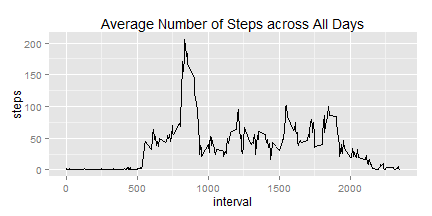
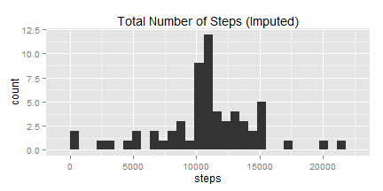
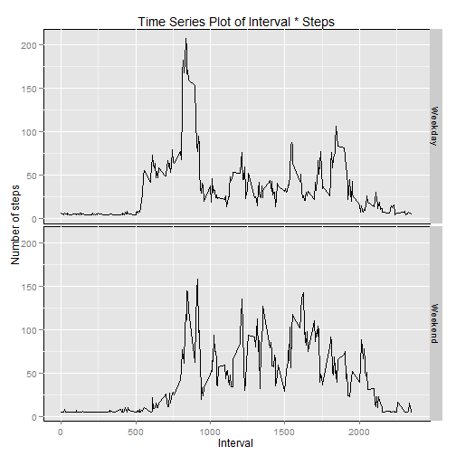

# Activity Monitoring Devices

### 1.Loading and preprocessing the data
Code:

```r
setwd("C:/Users/Ivan.Liuyanfeng/Desktop/Data_Mining_Work_Space/Reproducible_research/")
act.zip <- "activity.zip"
act.csv <- "activity.csv"
if(file.exists(act.zip)) unzip(act.zip)
act.data <- read.csv(act.csv, header=TRUE)
library(data.table)
tb.data <- data.table(act.data)
act.total <- tb.data[,sum(steps,na.rm=T),by=date]
head(act.total,n=5)
```

```
##          date    V1
## 1: 2012-10-01     0
## 2: 2012-10-02   126
## 3: 2012-10-03 11352
## 4: 2012-10-04 12116
## 5: 2012-10-05 13294
```

### 2.What is mean total number of steps taken per day?
2.1 Make a histogram of the total number of steps taken each day.

```r
library(ggplot2)
setnames(act.total, "V1","steps")
hist.s <- qplot(steps, data=act.total)
hist.s + labs(title="Total Number of Steps")
```

```
## stat_bin: binwidth defaulted to range/30. Use 'binwidth = x' to adjust this.
```

 

2.2 Calculate and report the mean and median total number of steps taken per day.

```r
step.mean <- mean(act.total$steps,na.rm=T)
step.median <- median(act.total$steps, na.rm=T)
```
##### The mean and median total number of steps taken per day are 9354.2295 and 10395, respectively.

### 3.What is the average daily activity pattern?
3.1 Make a time series plot of the 5-minute interval and the average number of steps taken, averaged across all days.

```r
act.avg <- tb.data[,mean(steps,na.rm=T),by=interval]
setnames(act.avg, "V1","steps")
ts <- ggplot(act.avg, aes(x=interval,y=steps))
ts + geom_line() + labs(title = "Average Number of Steps across All Days")
```

 

3.2 Which 5-minute interval, on average across all the days in the dataset, contains the maximum number of steps?

```r
step.max <- act.avg$interval[act.avg$steps==max(act.avg$steps)]
```
##### The 5-minute interval:  835, contains the maximum number of steps on average across all the days in the dataset.

### 4.Imputing missing values
4.1 Calculate and report the total number of missing values in the dataset.

```r
num_missing <- sum(is.na(act.data[,1]))
```
##### The total number of missing values in the data set is: 2304!

4.2 Devise a strategy for filling in all of the missing values in the dataset.

```r
imputed.data <- act.data
for (i in 1:nrow(act.data)){
        if (is.na(imputed.data[i,1])){ imputed.data[i,1] <- mean(act.data$steps, na.rm=T)}
}
```

4.3 Create a new dataset that is equal to the original dataset but with the missing data filled in.

```r
tb.imputed <- data.table(imputed.data)
imputed.total <- tb.imputed[,sum(steps,na.rm=T), by=date]
```

4.4 Make a histogram of the total number of steps taken each day and Calculate and report the mean and median total number of steps taken per day.

```r
#colnames(imputed.total)
setnames(imputed.total, "V1","steps")
hist.s.2 <- qplot(steps, data=imputed.total)
hist.s.2 + labs(title="Total Number of Steps (Imputed)")
```

```
## stat_bin: binwidth defaulted to range/30. Use 'binwidth = x' to adjust this.
```

 

```r
step.mean.imputed <- mean(imputed.total$steps, na.rm=T)
step.median.imputed <- median(imputed.total$steps, na.rm=T)
```
The mean and median total number of steps taken per day are 1.0766 &times; 10<sup>4</sup> and 1.0766 &times; 10<sup>4</sup> !

### 5.Are there differences in activity patterns between weekdays and weekends?
5.1 Create a new factor variable in the dataset with two levels.

```r
a <- as.character(imputed.data$date)
b <- strptime(a,"%Y-%m-%d")
c <- weekdays(b)
imputed.data$weekday <- c
imputed.data$wd_indicator[imputed.data$weekday == "Monday"]="Weekday"
imputed.data$wd_indicator[imputed.data$weekday == "Tuesday"]="Weekday"
imputed.data$wd_indicator[imputed.data$weekday == "Wednesday"]="Weekday"
imputed.data$wd_indicator[imputed.data$weekday == "Thursday"]="Weekday"
imputed.data$wd_indicator[imputed.data$weekday == "Friday"]="Weekday"
imputed.data$wd_indicator[imputed.data$weekday == "Saturday"]="Weekend"
imputed.data$wd_indicator[imputed.data$weekday == "Sunday"]="Weekend"
imputed.data$wd_indicator <- as.factor(imputed.data$wd_indicator)
head(imputed.data)
```

```
##   steps       date interval weekday wd_indicator
## 1 37.38 2012-10-01        0  Monday      Weekday
## 2 37.38 2012-10-01        5  Monday      Weekday
## 3 37.38 2012-10-01       10  Monday      Weekday
## 4 37.38 2012-10-01       15  Monday      Weekday
## 5 37.38 2012-10-01       20  Monday      Weekday
## 6 37.38 2012-10-01       25  Monday      Weekday
```

5.2 Make a panel plot containing a time series plot of the 5-minute interval and the average number of steps taken.

```r
imputed.avg <- data.table(imputed.data)
imputed.avg.weekday <- imputed.avg[wd_indicator=="Weekday",]
imputed.avg.weekend <- imputed.avg[wd_indicator=="Weekend",]
imputed.avg.weekday <- imputed.avg.weekday[,mean(steps, na.rm=T), by=interval]
imputed.avg.weekend <- imputed.avg.weekend[,mean(steps, na.rm=T), by=interval]
imputed.avg.weekday$wd_indicator <- "Weekday"
imputed.avg.weekend$wd_indicator <- "Weekend"
imputed.avg <- rbind(imputed.avg.weekday,imputed.avg.weekend)
#imputed.avg <- imputed.avg[,mean(steps, na.rm=T), by=interval]
g <- ggplot(imputed.avg, aes(interval, V1))
g + geom_line() + facet_grid(wd_indicator~.) + labs(y="Number of steps") + labs(x="Interval") + labs(title="Time Series Plot of Interval * Steps") + theme(panel.background = element_rect(colour = "blue"))
```

 
